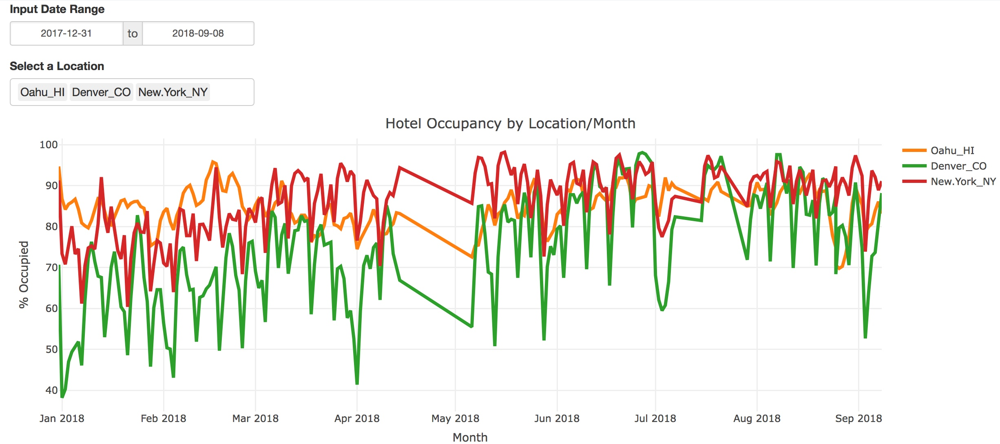

# BDAC 1 Graduation Repo: All the learns from 40 weeks and 120 nights of data class!
Clone this directory and launch a local server of jupyter notebooks in the directory to play around with the content and material that was shared live.

# Launch the Jupyter Notebook Collection
Click the badge below to access live versions of all of the notebooks we published. You can run the code and experiment with all of the live jupyter notebooks published and shared by the cohort.

# Launch the Shiny Dashboard Projects
Click on the badges below to launch the dashboards

STR Hotel Data Dashboard

EV Charger App Dashboard

Fitness Project Dashboard

# XerCises
You'll find snippets of codes and examples of how to do data and coding tasks in the XerCises directory. If you launch the collection with the badge above, you'll be able to run the code and even add your own notebooks. Download the whole collection and run jupyter notebooks locally for the most flexibility

# Classroom Materials
The content that was prepared for the class as well as the sprint outline materials and self assessment tools, roadmaps, etc, are all included in this folder. It's a great starting point for creating your own roadmap of a learning journey to mastering the data science concepts you need in your own work and projects!
